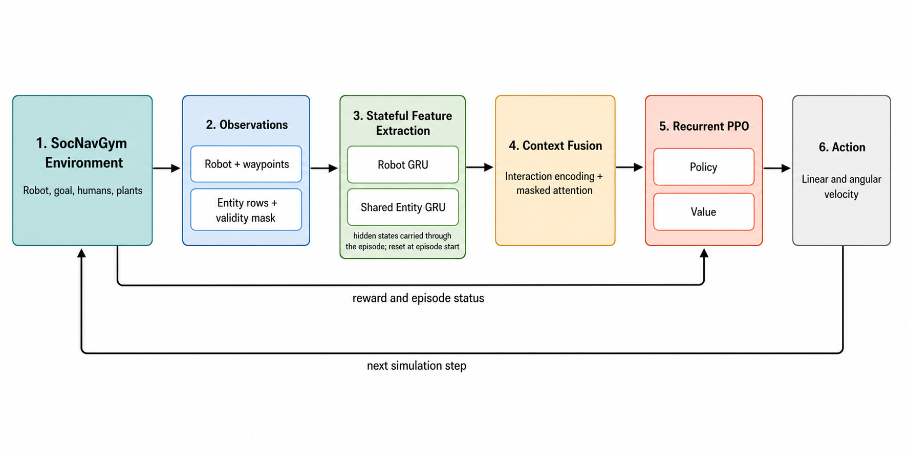

# A*-Guided Entity-Aware Social Navigation with PPO

This project addresses two-dimensional social robot navigation: a differential-drive robot must reach a goal efficiently while avoiding humans, static entities, and environment boundaries. The task is challenging because safe local actions depend on changing entity configurations, while purely reactive control can lose useful temporal context or become trapped in crowded scenes.

## Demonstration

<video controls width="900" src="assets/persistent_state_humans_plants_longest_success.mp4">
  Your browser does not support embedded MP4 video.
</video>

[Open the human-and-plant navigation video](assets/persistent_state_humans_plants_longest_success.mp4)

The demonstration replays seed `24150`, a successful held-out episode with a long A* reference path. The MP4 is recorded at 4 FPS to match the environment's 0.25-second simulation timestep.

## Contribution

The system combines an A* global planner with PPO-based continuous control. A* supplies local waypoint guidance, while entity-aware neural feature extractors encode the robot state and surrounding entities before masked attention fuses their interactions. The repository provides standard PPO and recurrent PPO training, deterministic held-out evaluation, an ORCA baseline, environment and attention inspection tools, trajectory visualization, video recording, and ready-to-render pretrained agents.

## System Overview



The global planner provides waypoint direction without replacing local collision avoidance. PPO predicts normalized linear and angular velocity commands, which are converted to SocNavGym's differential-drive action format. In the persistent-state model, recurrent state is carried between steps within an episode and reset when a new episode begins.

## Architectures

- **Feedforward MLP:** separate MLPs encode the current robot and entity observations. It has no learned temporal state.
- **Fixed-window BiGRU:** separate bidirectional GRUs encode an eight-observation history for the robot and each entity. Both directions operate over the available past window.
- **Persistent-state GRU:** unidirectional robot and entity GRUs carry hidden state throughout the episode, avoiding a fixed observation window. Hidden state is reset at episode boundaries.

All three variants use the same interaction embedding, masked entity attention, feature reduction, and PPO actor/critic interface, allowing the temporal encoders to be compared under a common downstream design.

## Held-Out Results

Results use 500 fixed held-out scenarios beginning at seed `24042`. Learned policies use deterministic actions. The human-only architectures were evaluated on the same scenarios; ORCA was evaluated as a paired classical baseline.

| Environment | Controller | Success | Collision | Timeout | Mean reward | Mean A*-SPL |
| --- | --- | ---: | ---: | ---: | ---: | ---: |
| Humans | Feedforward MLP | 81.4% | 18.4% | 0.2% | 7.551 | 0.722 |
| Humans | Fixed-window BiGRU | 68.6% | 31.4% | 0.0% | 5.918 | 0.656 |
| Humans | Persistent-state GRU | **82.2%** | **17.8%** | **0.0%** | **7.726** | **0.752** |
| Humans | ORCA | 29.2% | 70.4% | 0.4% | 0.589 | 0.272 |
| Humans and plants | Persistent-state GRU | 64.0% | 34.8% | 1.2% | 5.357 | 0.607 |
| Humans and plants | ORCA | 30.4% | 64.4% | 5.2% | 0.364 | 0.291 |

These figures describe selected checkpoints, not averages across independent training seeds. Checkpoint provenance, hashes, and exact held-out metrics are recorded under [`pretrained_agents/`](pretrained_agents/).

## Installation

The tested setup uses Python 3.10 on Linux/WSL. This project depends on
[SocNavGym](https://github.com/Tony-Ale/SocNavGym) and follows its
[installation requirements](https://github.com/Tony-Ale/SocNavGym#installation),
including Python-RVO2 and DGL. Python-RVO2 requires a C++ compiler and CMake.

```bash
git clone https://github.com/Tony-Ale/Hierarchical-Navigation.git
cd Hierarchical-Navigation
sudo apt-get install -y build-essential cmake python3-dev python3-venv git
python -m venv .venv
source .venv/bin/activate
python -m pip install --upgrade pip
python -m pip install -r requirements.txt
```

The requirements file installs the CPU build of PyTorch, DGL, and the tested
[SocNavGym revision](https://github.com/Tony-Ale/SocNavGym/tree/d5ac6597fad1b0d13efbf2678f274c0607e24507)
and Python-RVO2 revision. A separate SocNavGym clone is not required. CUDA users
can install the appropriate PyTorch build before installing the remaining
dependencies.

## Quick Start

Activate the environment after installation:

```bash
source .venv/bin/activate
```

### Testing While Rendering

Render the packaged persistent-state humans agent:

```bash
python -m testing_pipeline.render_agent --config pretrained_agents/persistent_state_humans/render_config.yaml
```

The humans-and-plants config records its successful long-path episode to `assets/`:

```bash
python -m testing_pipeline.render_agent --config pretrained_agents/persistent_state_humans_plants/render_config.yaml
```

### Standard PPO Training

Both training configs start a new timestamped run by default. Set the resume fields explicitly only when continuing an existing checkpoint.

```bash
python -m training_pipeline.train --config training_pipeline/config.yaml
```

### Persistent-State PPO Training

```bash
python -m stateful_training_pipeline.train --config stateful_training_pipeline/config.yaml
```

### Final Testing

```bash
python -m testing_pipeline.runner --config runs/<run>/experiment_config.yaml --run-dir runs/<run> --checkpoint runs/<run>/checkpoints/<checkpoint>.zip
```

### Offline Evaluation

Set `run_dir` and `training_config_path` in `testing_pipeline/offline_evaluation_config.yaml` to the completed run. The public default evaluates its final checkpoint on 100 fixed seeds and compares it with ORCA.

```bash
python -m testing_pipeline.evaluate_checkpoints --config testing_pipeline/offline_evaluation_config.yaml
```

### Environment Inspection

```bash
python -m environment_inspection.inspect_environment --config environment_inspection/config.yaml
python -m environment_inspection.attention_analysis --config environment_inspection/attention_analysis_config.yaml
```

### Automated Tests

```bash
python -m unittest discover -s tests -p 'test_*.py'
```

## Repository Structure

```text
assets/                      Public README diagram and demonstration video
architectures/               Neural feature extractors and architecture configs
custom_rewards/              Social-safety, waypoint, and static-obstacle rewards
env_configs/                 SocNavGym training and evaluation scenarios
environment_inspection/      Policy inspection, attention, failure, and trajectory tools
global_planning/             A* planner and SocNavGym planning wrapper
navigation_features/         Coordinate-frame waypoint and wall features
pretrained_agents/           Selected checkpoints with self-contained render configs
stateful_training_pipeline/  Persistent-state recurrent PPO training
testing_pipeline/            Unified testing, offline evaluation, plots, and rendering
tests/                       Unit and integration tests
training_pipeline/           Standard PPO training for non-persistent architectures
```

`runs/`, local simulator clones, generated plots, and most rendered media are intentionally excluded from version control. The selected public checkpoints and README assets are retained explicitly.

## License

This project's original code is released under the [MIT License](LICENSE). Third-party dependencies, including SocNavGym and Python-RVO2, remain subject to their respective licenses.
